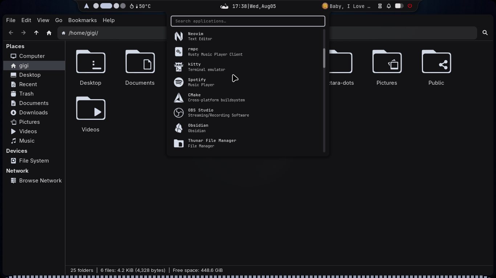
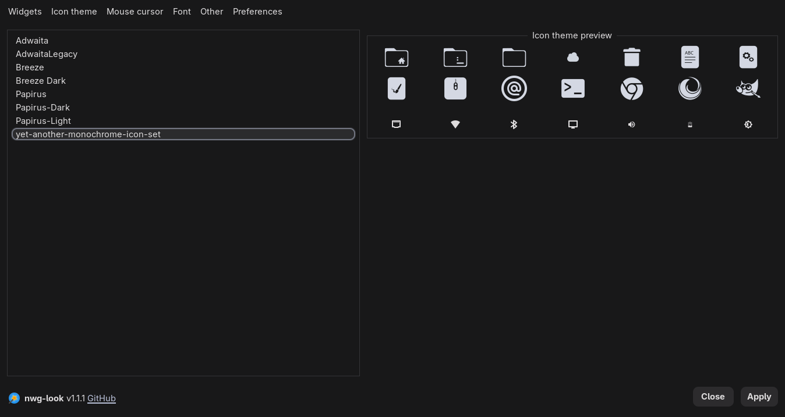

# Icons

Noctara Dots includes the **YAMIS** (Yet Another Monochrome Icon Set) icon pack, which is automatically installed alongside the rest of the configuration.

If you'd like your desktop to match the screenshots shown throughout the documentation, it's recommended to use this icon theme.

---

# Preview

The YAMIS icon pack gives applications and folders a clean look while fitting nicely with any wallpaper you use.

<p align="center">
  
</p>

---

# Install NWG-Look

The easiest way to manage GTK themes, icons, and cursors on Wayland is with **nwg-look**.

Install it using:

```bash
yay -S nwg-look
```

---

# Applying the Icon Theme

1. Launch **nwg-look**.

2. Open the **Icons** tab.

3. Select **YAMIS** from the list of installed icon themes.

4. Click **Apply**.

<p align="center">
  
</p>

---

> [!TIP]
> While you're in **nwg-look**, you can also change your GTK theme, cursor theme, and fonts to further personalize your desktop.
