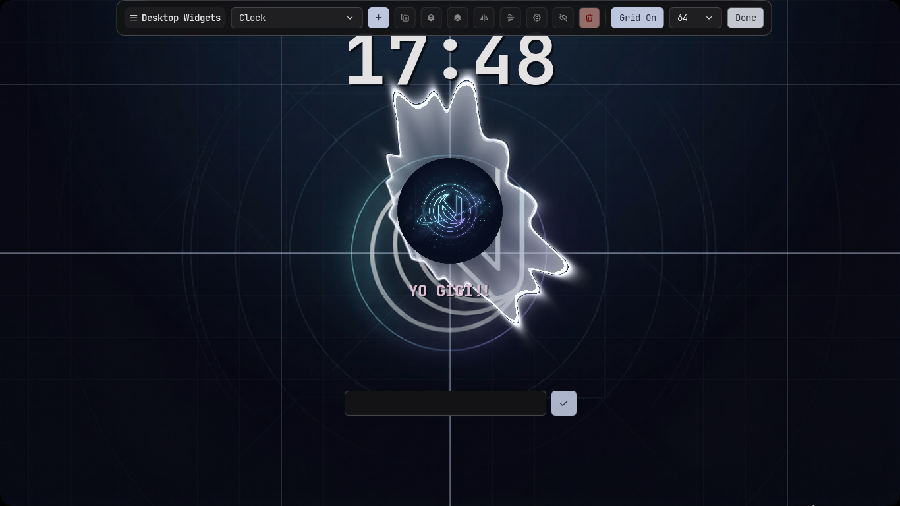
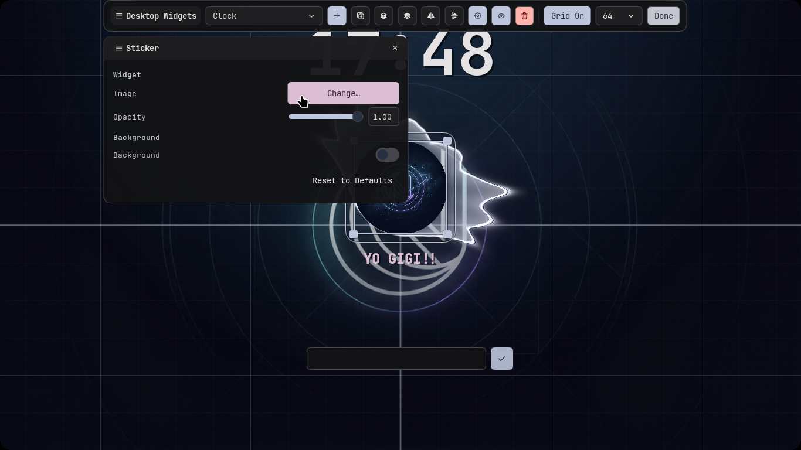

# Noctalia Shell

One of the best things about Noctalia is how easy it is to customize.

Unlike many desktop shells that require editing configuration files, most of Noctalia's appearance can be changed directly through its built-in settings. Whether you want to tweak colors, animations, widgets, or the lock screen, everything is designed to be simple and accessible.

Noctara Dots only provides the starting point. Feel free to experiment and make the shell your own.

---

# Lockscreen

The lockscreen included with Noctara Dots has been customized using Noctalia's built-in editor.

By default, it includes the following widgets:

- 🕒 Clock
- 🎵 Fancy Music Visualizer
- 📝 Text Sticker
- 🔐 Password Box

These can all be moved, resized, removed, or replaced directly from the lockscreen editor.

  

---

# Changing the Sticker

The default lockscreen sticker uses the **Noctara logo**, but you can easily replace it with your own image.

Open the **Noctalia Lockscreen Editor**, select the **Sticker** widget, and choose any image you'd like to display.

  

Once applied, the new image will appear on your lockscreen immediately.

> [!TIP]
> Try using your favorite anime character, logo, profile picture, or any transparent PNG. Small square images generally look the best.
