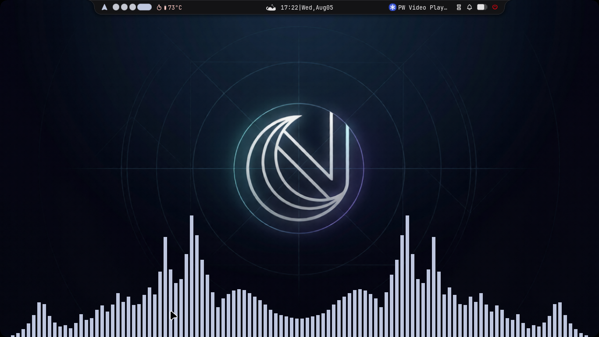

# Wallpapers

Noctara Dots comes with a default wallpaper that matches the overall look and feel of the desktop.

The installer automatically copies it to your wallpaper directory, so you can start using Noctara right away without hunting for a wallpaper first.

  

---

# Looking for More Wallpapers?

If you'd like a larger collection to get started, I also maintain a wallpaper repository with hand-picked wallpapers that fit the same aesthetic as Noctara.

It's completely optional, but it's a nice place to start if your wallpaper folder is currently looking a little empty.

👉 **FireWalls Repository** _(https://github.com/deadduck-09/FireWalls)_
