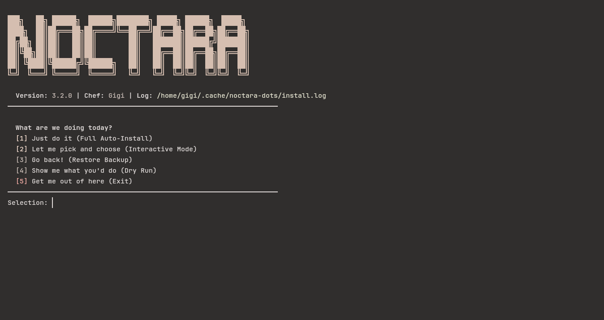

# Installation

Installing Noctara Dots is designed to be simple.

The installer handles the boring parts of setting up a complete desktop environment so you can focus on using and customizing your setup instead of manually copying configuration files everywhere.

The installer is currently designed for **Arch Linux** and is focused around **Wayland-based setups**, especially:

- Niri
- Hyprland
- Noctalia Shell

---

# What Does The Installer Do?

The Noctara Dots installer is more than just a config copier. It prepares your system, checks dependencies, creates backups, and deploys the complete desktop setup.

The installation process follows these steps:

```
System Check
      ↓
Dependency Detection
      ↓
Package Installation
      ↓
Backup Existing Configs
      ↓
Deploy Noctara Configurations
      ↓
Setup Shell Environment
      ↓
Reload Applications
      ↓
Installation Summary
```

---

# Window Managers

Noctara Dots supports:

### Window Managers

- Niri
- Hyprland
- Mango

The installer automatically detects which compositor you have installed and only applies the matching configuration.

For example:

- If you have Niri installed → Niri configuration will be deployed
- If you have Hyprland installed → Hyprland configuration will be deployed
- If both are installed → You can use both configurations

The installer will not force a specific workflow. It simply provides the configuration foundation.

---

# Installing Noctara Dots

Clone the repository:

```bash
git clone https://github.com/deadduck-09/Noctara-Dots.git
```

Enter the directory:

```bash
cd Noctara-Dots
```

Run the installer:

```bash
./install.sh
```

The Noctara installer menu will appear.



---

# Installation Modes

The installer provides multiple options depending on how much control you want.

## 1. Full Auto Install

```
[1] Just do it (Full Auto-Install)
```

This is the easiest option.

The installer automatically:

- Checks your system
- Installs missing packages
- Installs Noctalia Shell if needed
- Creates backups
- Deploys configurations
- Sets up your selected shell
- Reloads supported applications

This option is recommended for users who simply want the complete Noctara experience.

---

## 2. Interactive Installation

```
[2] Let me pick and choose
```

This mode gives you more control.

You can choose which configurations should be installed instead of installing everything.

Useful if you:

- Already have some applications configured
- Only want specific parts of Noctara Dots
- Want to test the setup gradually

---

## 3. Restore Backup

```
[3] Go back! (Restore Backup)
```

Before changing your configuration, Noctara Dots creates a backup.

If something goes wrong or you want to return to your previous setup, the restore option can bring your old configuration back.

Backups are stored as:

```
~/.config-backup-date-time/
```

Example:

```
~/.config-backup-2026-08-05-132000/
```

---

## 4. Dry Run

```
[4] Show me what you'd do
```

Dry run mode allows you to preview what the installer would do without actually changing anything.

It will show:

- Missing packages
- Configurations that would be installed
- Actions that would happen

Nothing is modified.

This is useful if you want to understand the installer before running it.

---

# What Gets Installed?

The installer checks and installs the required components for the Noctara setup.

Main components include:

| Component      | Purpose                    |
| -------------- | -------------------------- |
| Noctalia Shell | Desktop shell and UI       |
| Kitty          | Terminal emulator          |
| Waybar         | Status bar                 |
| MPD            | Music daemon               |
| MPV            | Media player               |
| Fastfetch      | System information display |
| Yazi           | Terminal file manager      |
| rmpc           | Terminal music client      |
| Neovim         | Editor configuration       |

The installer does not blindly reinstall everything. If something is already installed, it detects it and skips unnecessary work.

---

# Configuration Deployment

Noctara Dots stores configurations inside the repository:

```
configs/
├── niri/
├── hypr/
├── kitty/
├── waybar/
├── mpd/
├── mpv/
├── fastfetch/
├── yazi/
└── rmpc/
```

During installation, these are copied into:

```
~/.config/
```

Example:

```
configs/kitty
        ↓
~/.config/kitty
```

The same structure makes it easier to modify or remove individual components later.

---

# Backup System

Noctara Dots never replaces your configuration without creating a backup first.

Before deployment, it checks for existing folders like:

```
~/.config/niri
~/.config/hypr
~/.config/kitty
```

If they exist, they are copied into a backup directory.

This means you can experiment safely without worrying about losing your previous setup.

---

# Shell Setup

During installation, you can choose your terminal shell setup:

## Zsh + Powerlevel10k

Includes:

- Zsh configuration
- Oh My Zsh
- Powerlevel10k theme
- Useful plugins

## Fish + Starship

Includes:

- Fish shell configuration
- Starship prompt
- Custom aliases and settings

## Keep Existing Shell

No changes will be made.

---

# Installer Safety Features

The installer includes several protections:

### Error Handling

If something fails, the installer stops instead of continuing with a broken setup.

### Logging

Installation logs are saved here:

```
~/.cache/noctara-dots/install.log
```

This helps with troubleshooting.

### Dependency Checking

The installer checks whether required applications already exist before installing anything.

### Backup Before Changes

Existing configurations are preserved before modification.

---

# After Installation

Once the installer finishes:

1. Log out of your current session
2. Select your compositor:

   - Niri
   - Hyprland
   - Mango

3. Log back in
4. Enjoy your new desktop 🌙

Some applications may require a restart before their configuration is fully applied.

---

# Troubleshooting

If something does not work:

Check the installer log:

```bash
cat ~/.cache/noctara-dots/install.log
```

Common fixes:

### Missing dependencies

Run:

```bash
sudo pacman -Syu
```

and rerun the installer.

### Broken configuration

Use the restore option:

```bash
./install.sh
```

and choose:

```
[3] Restore Backup
```
